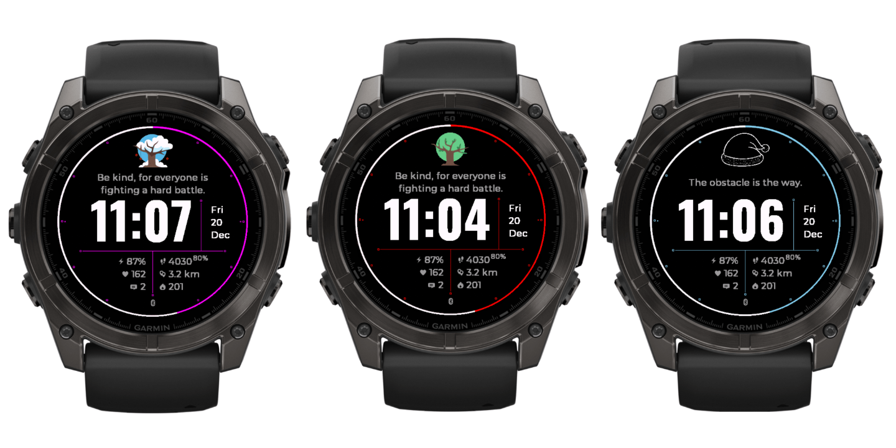

# Kago - WatchFace for Garmin Fēnix 8+

* At Connect IQ [here](https://apps.garmin.com/apps/0866d1f2-2b9c-4a6f-8d50-a544de9c18ca?tid=0)
* It's using Connect IQ 7.3.1 SDK version (API docs [here](https://developer.garmin.com/connect-iq/api-docs/))

## Fonts

1. You can convert TTF file to FNT via https://ttf2fnt.com/
2. Just make sure that both the .fnt and .png file are present. Also inside the .fnt file make sure that it points to the right .png.

## Resources

* Docs: https://developer.garmin.com/

## Misc

Res: 454x454

* Inspiration: https://github.com/bombsimon/awesome-garmin?tab=readme-ov-file#watch-faces

## Attribution

Season picture developed by [Freepik here](https://www.freepik.com/free-vector/months-year-template-design_33802328.htm#fromView=keyword&page=1&position=12&uuid=9343120e-e1c9-4ccb-873b-1c1bb6aa44f6) and [here](https://www.freepik.com/free-vector/calendar-with-sketchy-seasonal-elements_823715.htm#fromView=keyword&page=1&position=33&uuid=9343120e-e1c9-4ccb-873b-1c1bb6aa44f6). Gallery [here](https://www.freepik.com/free-photos-vectors/months-year-icon).

## How to deploy the watch face on your watch without the store

You'll need to build the watch face for the device by using Cmd+Shift+P in VSCode and choose "Monkey C: Build for Device". The result of that proccess you can probably find in the `dist` directory (under the `build_for_device`). You then will need a away to transfer the files from your Mac to the watch. Fenix 8 is using MTP protocol. [OpenMTP](https://openmtp.ganeshrvel.com/) is a good option. Copy a single file, the `.prg` file (in this case `Kago.prg`) to `/GARMIN/Apps` directory on the watch.